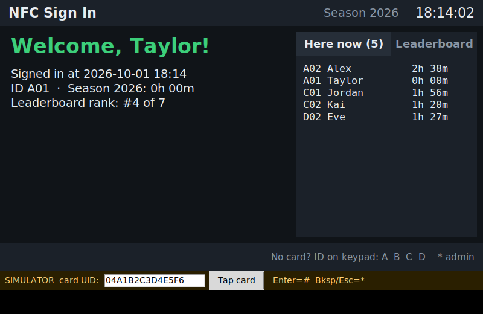

# RPi NFC Login System

A sign-in / sign-out kiosk for a Raspberry Pi 4 B. People tap an NFC card to
sign in and tap again to sign out. The Pi tracks their hours in MariaDB, shows
a live leaderboard on a 5 inch touchscreen, and writes each person's latest
stats back onto their card along with a link a phone can open.




## What it does

- **Tap to sign in, tap again to sign out.** Every scan toggles the person.
- **Hours come from the database only.** The card is identified by its
  factory UID; nothing written on the card is ever read back, so editing a
  card can't add hours.
- **Card contents refresh on every scan:** user ID, username, season time
  (hours + minutes), leaderboard rank, last sign-in, last sign-out, and a link
  to the (placeholder) GitHub Pages site.
- **Four teams and the mentors.** A Robot, B Impact, C Sustainability and
  D Strategy: IDs are the team letter plus a number (A007, B012), up to 999
  per team, and the letter keys start typing one. Mentors have number-only
  IDs (007), typed with just the digits. Only an admin picks someone's team.
- **Who's here, live:** a tap-to-switch panel on the kiosk and a web page at
  `http://<pi>:8080/` that phones on the network can open.
- **Leaderboard** on screen and on the web page, recalculated after every scan.
- **Admins can add or subtract hours** from the kiosk keypad, the web admin
  page or the command line. Every change is logged with a reason.
- **Only admins can enroll cards** (kiosk admin menu behind the admin PIN, or
  the admin CLI on the Pi).
- **Keypad or touchscreen, either one:** every menu choice is also a button on
  the screen, and ID and PIN screens show an on-screen keypad. Look yourself
  up or sign in by ID + PIN when you forget your card.
- **Admin menu on the kiosk itself** (People, Hours, System): add people,
  enroll or remove cards, set PINs, change teams, adjust hours, Wi-Fi,
  updates, restart and shut down. No keyboard or web page needed.
- **Season resets** archive the old season, start everyone at 0h 00m for the
  new year, and keep all users, cards and history.
- **Legacy system support:** imports users, cards, hours and past seasons
  from [aesom-e/attendance](https://github.com/aesom-e/attendance), and its
  MIFARE Classic cards keep working on the PN532. See
  [docs/legacy.md](docs/legacy.md).
- **Simulator mode** runs the whole kiosk on a normal computer, no hardware.

## Hardware

| Part | Notes |
|---|---|
| Raspberry Pi 4 Model B | Raspberry Pi OS Bookworm (desktop) |
| 5 inch 800x480 touchscreen | HDMI/DSI, USB touch |
| Elechouse PN532 NFC Module V3 | SPI mode |
| 4x4 matrix keypad | From the SunFounder Da Vinci Kit |
| NTAG215 cards/stickers | Recommended; NTAG213/216 and MIFARE Classic 1K also work |
| 3D printed shell | `enclosure/` in the project library (body, top, tray) |

Wiring is in [docs/hardware.md](docs/hardware.md).

## Quick start (on the Pi)

```bash
git clone https://github.com/LunarcatOwO/rpi-login-system.git
cd rpi-login-system
bash scripts/install.sh                         # packages, MariaDB, SPI, service
.venv/bin/python -m nfc_login.admin set-admin-pin
.venv/bin/python -m nfc_login.admin user add "Taylor" --section A    # -> A001
sudo reboot
```

Then enroll a card from the kiosk: press **\***, enter the admin PIN and
**#**, press **1**, type the user ID (**A** **0** **1**), and tap the new card.
The live page is at `http://<pi-address>:8080/`, the admin page at `/admin`.

## Try it without hardware

```bash
pip install -r requirements.txt
cp config.example.toml config.toml   # set the database login, mode = "simulated"
python3 -m nfc_login.admin init-db
python3 -m nfc_login.admin user add "Test User" --section A
python3 -m nfc_login.admin tag enroll A001 --uid 04A1B2C3D4E5F6
python3 -m nfc_login --simulate --windowed
```

## Documentation

| Doc | What's in it |
|---|---|
| [docs/hardware.md](docs/hardware.md) | Parts, wiring, PN532 switch settings, the enclosure |
| [docs/setup.md](docs/setup.md) | Installing on the Pi step by step, autostart, backups |
| [docs/usage.md](docs/usage.md) | Scanning, keypad, teams and IDs, live page, web admin, CLI reference |
| [docs/nfc-tags.md](docs/nfc-tags.md) | What's written on each card and why it's never trusted |
| [docs/seasons.md](docs/seasons.md) | How season resets and archives work |
| [docs/legacy.md](docs/legacy.md) | Importing from the old attendance system, old MIFARE Classic cards |
| [docs/database.md](docs/database.md) | MariaDB tables and how hours are calculated |
| [docs/architecture.md](docs/architecture.md) | How the code is organised |
| [electron/README.md](electron/README.md) | The desktop app: the kiosk fullscreen as an Electron app, packaged for the Pi |

## Code layout

```
nfc_login/
  config.py      settings from config.toml
  db/            MariaDB schema, connection, SQL queries
  hardware/      PN532 reader, keypad, simulator
  legacy/        old card numbers + importer for the legacy attendance system
  tags/          NDEF encoding and the card payload
  services/      attendance, leaderboard, seasons, users, PINs
  kiosk/         scan + keypad behaviour, NFC polling thread
  ui/            Tkinter touchscreen window
  web/           live "who's here" page + admin page (stdlib HTTP server)
  admin/         command-line admin tool
tests/           pytest suite
scripts/         install script and systemd unit
```

## Tests

```bash
pip install -r requirements-dev.txt
pytest                                     # unit tests only
NFC_LOGIN_TEST_DB_USER=root pytest         # plus database tests (needs MariaDB)
```

The database tests create and drop a `nfc_login_test` database.
