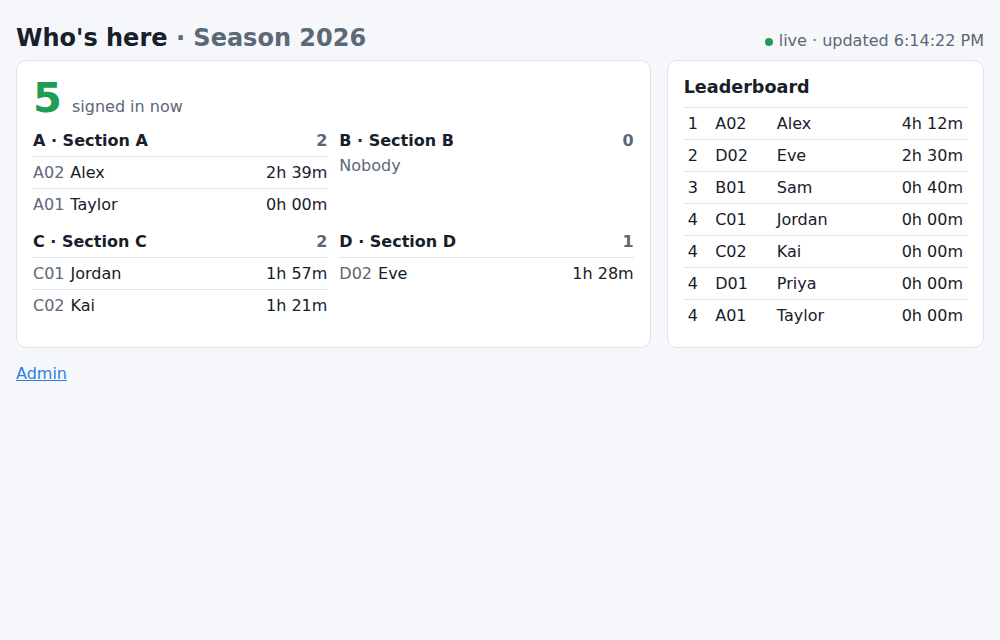
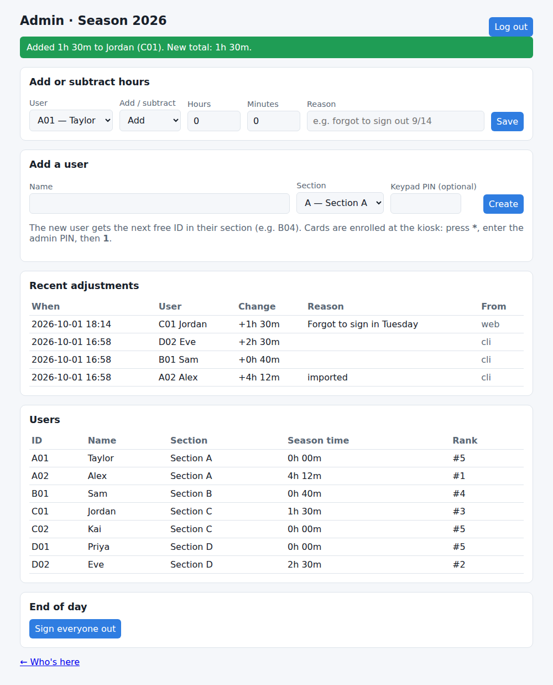

# Using the kiosk

## User IDs and teams

Everyone is on one of four **teams**, one per letter key on the keypad, or
is a **mentor**:

| Key | Team | IDs |
|---|---|---|
| A | Robot | A001 to A999 |
| B | Impact | B001 to B999 |
| C | Sustainability | C001 to C999 |
| D | Strategy | D001 to D999 |
| (none) | Mentors | 001 to 999, just the number |

IDs are handed out in order when a user is created (the first person on
Impact is B001), so each team and the mentors hold up to 999 people. An
admin picks someone's team when creating or moving them. The one exception
is an imported old card: on its first tap the owner picks their own team,
and only choosing Mentors needs the admin PIN (see below).

Team names are set in `[[sections]]` in `config.toml`.

## Signing in and out

Hold your card on the reader until the screen changes.

- **Signed out → signed in:** "Welcome, *name*!" with your ID, team, season total and rank.
- **Signed in → signed out:** "Goodbye, *name*!" with this session's length,
  your new total and rank.

Keep the card on the reader for a moment after the screen changes: that's
when your latest stats are written onto it.

Rules:

- Scanning again within **10 seconds** of signing in or out is ignored, so a
  double tap doesn't undo itself. (`min_scan_interval_seconds`)
- If you forget to sign out, the session is closed with **no time credited**
  once it passes **12 hours** (at your next scan, or by the 03:00 clean-up).
  An admin can add the time back (see below). (`max_session_hours`)
- Unknown or removed cards show "Card not registered".

## Who's here

The right side of the kiosk screen has two tabs you can tap:

- **Here now (N):** everyone signed in right now, with how long they've been
  here. It updates every 5 seconds and after every scan.
- **Leaderboard:** the season ranking.

The clock in the top right is the current time.

The same live list is on a web page anyone on the network can open on a
phone or laptop: **`http://<pi-address>:8080/`**. It's grouped by team,
updates every 3 seconds, and shows the leaderboard (with each person's team)
too. The Pi's address is
shown under the admin menu → 5 (System info).



## Keypad

```
 1  2  3  A        A B C D   start typing a team member's ID (A007, B012...)
 4  5  6  B        0-9       digits. From the start screen: a mentor's ID (007)
 7  8  9  C        *         delete / back. From the start screen: admin menu
 *  0  #  D        #         Enter
```

Half-typed input clears itself after 30 seconds.

### Look yourself up, or sign in without your card

Type your ID: the team letter, then the number (`B` `0` `0` `7`). After
three digits it goes straight through (or type `B` `7` `#`). Mentors type
just their number (`0` `0` `7`, or `7` `#`). The screen shows your
season time, rank, whether you're signed in, and your last sign-in and
sign-out.

Then press **1** to sign in or out with your PIN, and `#`. This only works
if an admin has set a PIN for you; otherwise use your card. Five wrong PINs
lock the keypad for a minute.

### Admin menu

Press **`*`** on the start screen, enter the admin PIN, `#`, then:

| Key | Action |
|---|---|
| 1 | **Enroll a card:** type the user ID, then tap the new card |
| 2 | **Add / subtract hours:** type the user ID, the time, then **A** add or **B** subtract |
| 3 | Who is here |
| 4 | Sign everyone out (end of the day; time is credited) |
| 5 | System info (hostname, IP address, reader firmware) |
| 6 | **Change someone's team:** type the user ID, then the team's number (1-5) or letter. They get the next free ID there |
| * | Back / exit |

Typing time for option 2: hours then two-digit minutes. `130` = 1h 30m,
`45` = 45m, `200` = 2h.

Only admins can enroll cards: the kiosk asks for the admin PIN first, and
otherwise the only way is the admin command line on the Pi.

## Web admin page

`http://<pi-address>:8080/admin`, log in with the same admin PIN. From there:

- **Add or subtract hours** for anyone, with a reason. Every change is listed
  under "Recent adjustments" and in the season's archive CSV.
- **Add a user** (name, team, optional PIN). They get the next free ID.
- **Change someone's team.** They get the next free ID in the new team.
- See every user's ID, team, season time and rank.
- Sign everyone out.



The login lasts 30 minutes of inactivity. Five wrong PINs block logins for a
minute. Cards can't be enrolled from the web page because the card has to be
on the reader; use the kiosk admin menu.

The page uses plain HTTP and is meant for your local network only. Don't
forward port 8080 to the internet.

## Admin command line

Run on the Pi from the repo folder (over SSH is fine):

```bash
.venv/bin/python -m nfc_login.admin <command>
```

| Command | What it does |
|---|---|
| `init-db` | Create tables and the first season. Safe to re-run. |
| `set-admin-pin` | Set the admin PIN (kiosk and web page) |
| `user add "Name" --section B [--pin]` | Create a user on a team (A-D, or M for a mentor); prints the new ID, e.g. B004 |
| `user list [--all]` | List users with ID and team |
| `user show B004` | Time, rank, last sign-in/out |
| `user rename B004 "New Name"` | Change a username |
| `user move U003 B` | Put someone on another team, or `M` for mentors (they get its next free ID) |
| `user set-pin B004 [--clear]` | Set or remove a keypad PIN |
| `user deactivate B004` / `activate B004` | Hide someone (history is kept; their cards stop working) |
| `hours add B004 1h30m [--reason "..."]` | Add time this season |
| `hours subtract B004 45m [--reason "..."]` | Take time off (not below zero) |
| `hours history` | Recent adjustments |
| `tag enroll B004 [--uid HEX]` | Link a card. Without `--uid` it waits for a tap (stop the kiosk first) |
| `tag list` | All cards and owners |
| `tag remove UID` | Lost card: stop it working |
| `tag read` | Print the UID, card type and the info written on the card on the reader (retries if the card wobbles) |
| `buzzer [PATTERN...]` | Play buzzer patterns to check the wiring (all of them by default) |
| `season show` / `season list` | Current / all seasons |
| `season new [NAME] [--yes]` | Season reset (see [seasons.md](seasons.md)) |
| `season leaderboard [NAME]` | Leaderboard for any season |
| `season export [NAME]` | Write CSV files for a season |
| `sessions open` | Who's signed in now |
| `sessions sign-out-all` | Sign everyone out, crediting time |
| `sessions close-stale` | Close sessions older than `max_session_hours` with no credit |
| `import-legacy --legacy-config PATH [--sections A] [--dry-run]` | Import from the old attendance system ([legacy.md](legacy.md)) |

Times for `hours` can be written `1h30m`, `2h`, `45m` or `1:30`.

## Simulator

`python3 -m nfc_login --simulate --windowed` (or `mode = "simulated"` in
`config.toml`) runs on any computer with Python 3.11+, Tk and access to a
MariaDB server. A yellow bar at the bottom lets you type a card UID and press
**Tap card**. The computer keyboard acts as the keypad: `0-9`, `A-D`, `*`,
`#`, with Enter = `#` and Backspace/Esc = `*`. The web page runs too.
